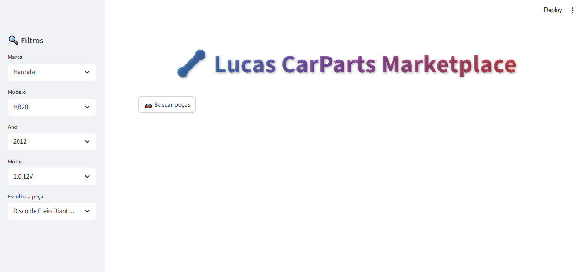
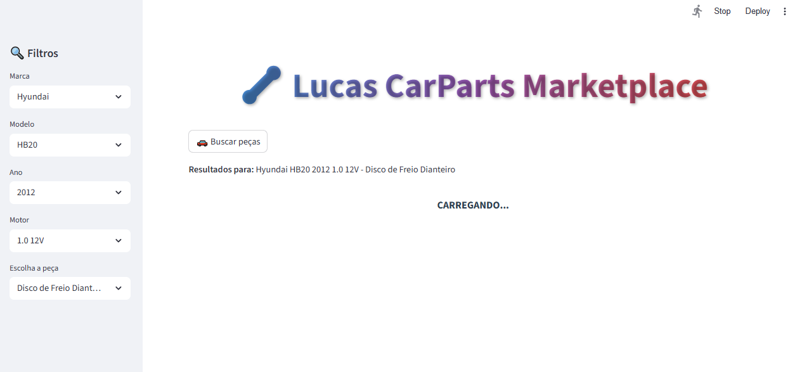
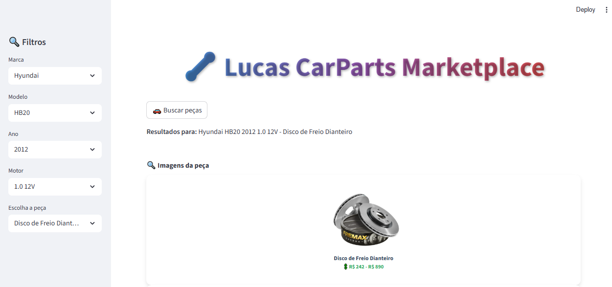
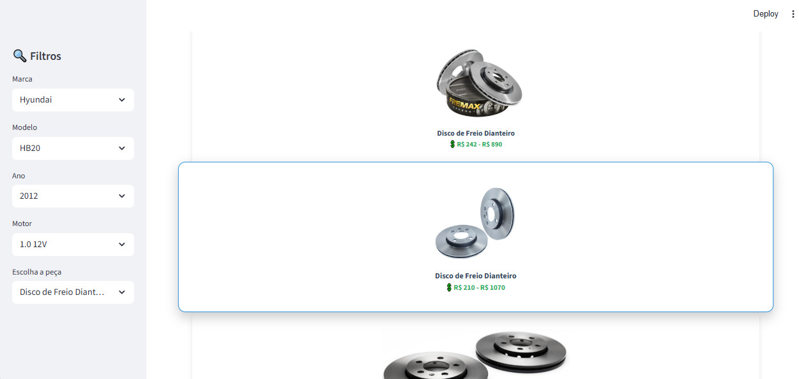
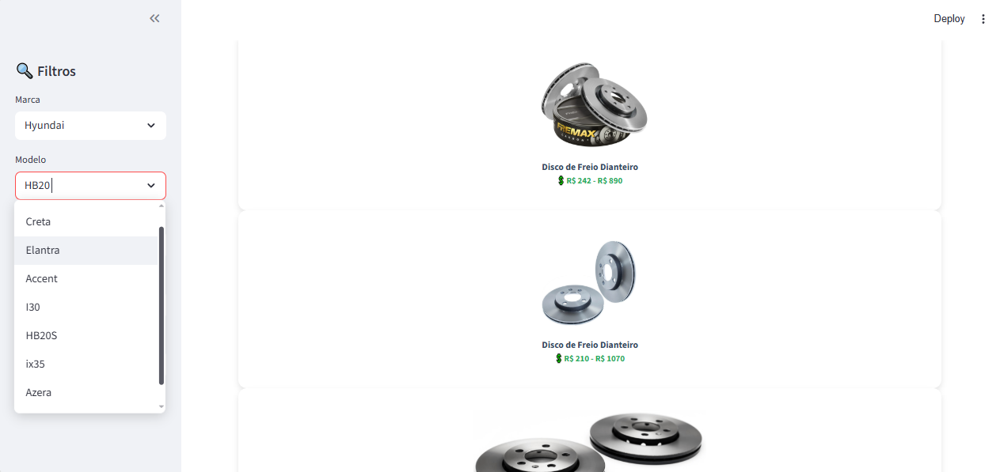

# 🔧 Lucas CarParts Marketplace


## 🚀 Projeto
O **Lucas CarParts Marketplace** é um **app web interativo** para buscar peças automotivas por **marca, modelo, ano e motor**, exibindo **imagens** e **preços simulados**.  
O projeto combina **Python, Streamlit, Pandas e integração com APIs externas**, com um layout moderno e cards animados.

---

## 🎯 Funcionalidades
- Filtros dinâmicos dependentes (marca, modelo, ano, motor, peça)
- Busca automática de imagens via **Google Custom Search API**
- Cards interativos com hover e clique para abrir imagens
- Histórico das últimas 5 pesquisas
- Preços simulados para realismo  
- Animação de “carregando” enquanto busca imagens.
- Layout limpo, moderno e responsivo.

---

## 🖥️ Demonstração Visual
  



  
*Demonstração do app com filtros e resultados.*

---

## 🛠️ Tecnologias
- **Python** – Lógica e backend
- **Streamlit** – Interface web interativa
- **Pandas** – Manipulação de dados e filtragem de dados dos CSVs
- **Requests** – Integração com APIs externas
- **CSS/HTML** – Estilização e animações

---

## ⚡ Instalação e Execução
1. Clone o repositório:
```bash
git clone https://github.com/LucasMata33/Lucas_CarParts_Marketplace.git
```

2. Entre na pasta:
```bash
cd lucas-carparts-marketplace
```

3. Instale dependências:
```bash
pip install -r requirements.txt
```

4. Configure a **Google API** (via `secrets.toml` ou variáveis de ambiente):
```toml
[google_api]
api_key = "SUA_API_KEY"
cse_id = "SEU_CSE_ID"
```

5. Execute o app:
```bash
streamlit run app.py
```

---

## 💡 Boas práticas 
- os arquivos CSV (`carros.csv`, `pecas.csv`) organizados.  
- Código modular e escalável: fácil de adicionar **novas funcionalidades**, como banco de dados, preços reais ou carrinho de compras.  

---

## 📈 Impacto / Aprendizados
- Integração com **API externa** e manipulação de dados.  
- Desenvolvimento de **UX/UI interativa** com cards e animações.  
- Criação de histórico de pesquisas usando **session_state do Streamlit**.  
- Preparação para evoluir para um **marketplace real completo**.  

---

## 📬 Contato
**Lucas Galdino da Mata**
📧 lucasgaldinodamata33@hotmail.com  
🔗 [LinkedIn](https://www.linkedin.com/in/lucas-galdino-da-mata-6834621a4/)
📞 [WhatsApp](https://wa.me/5521966369431?text=Olá%20Lucas,%20vim%20pelo%20GitHub!)
